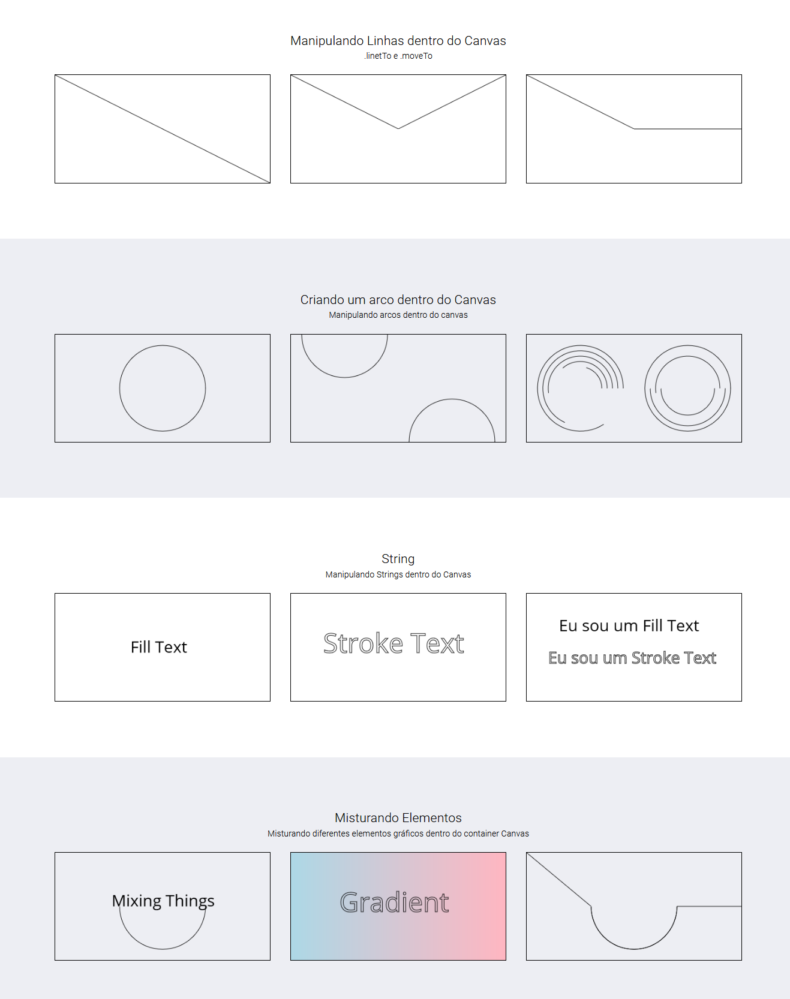

# HTML-Canvas
Este estudo teve como objetivo explorar a propriedade Canvas do HTML. Dentro do canvas conseguimos desenvolver e manipular gráficos, que nos permitem criar formas geométricas através de calculos, além de animações e interações entre elementos através da programação Javascript. 

## Tela

